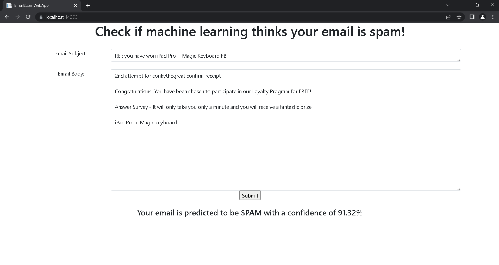

# EmailSpamWebApp

This is a simple web app created with ASP.NET Core Razor pages that uses a machine learning model to predict if the posted email contents are spam. 

The machine learning model was trained using [ML.NET binary classification](https://learn.microsoft.com/en-us/dotnet/machine-learning/tutorials/sentiment-analysis-model-builder). 

The training data can be found in the [ML Training Data](https://github.com/ConkyTheGreat/ML-Email-Spam-Web-App/tree/master/ML%20Training%20Data) folder. I obtained the data from [this Kaggle repository](https://www.kaggle.com/datasets/nitishabharathi/email-spam-dataset). I combined the 3 individual datasets from Kaggle into a single file, cleaned it (removed numbers, URLs, new line characters, etc.), and saved it as the EmailDataset.csv found in this Github repo. 

This web app can also be downloaded and ran via Docker:
- In a terminal, run `docker pull conkythegreat/email-spam-web-app-repo`
- Run `docker run --publish 8000:80 conkythegreat/email-spam-web-app-repo`
- In your web browser, navigate to `localhost:8000` and the web app should be running

